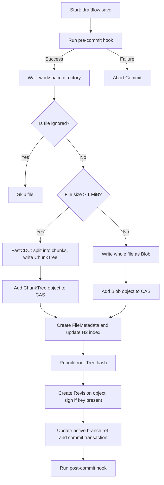
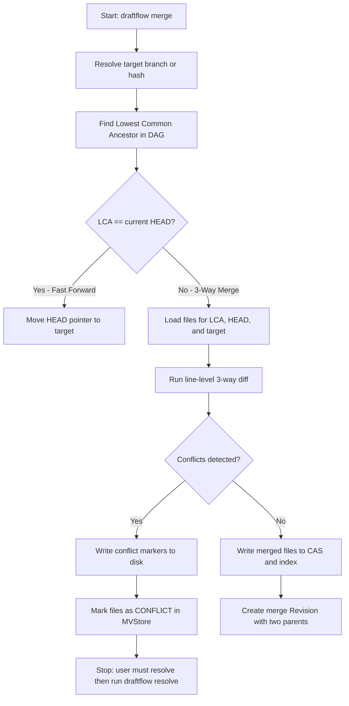
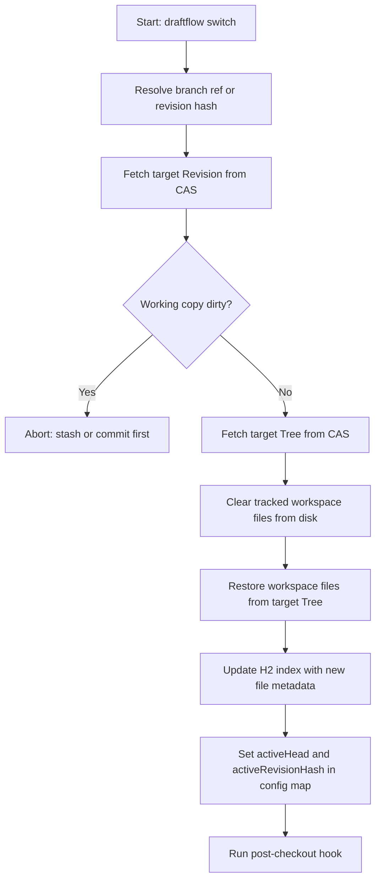

# DraftFlow VCS

*High-Performance, snapshot-based version control system built on a Directed Acyclic Graph (DAG).*

---

## Table of Contents

1. [Overview](#overview)
2. [Overall Architecture](#overall-architecture)
3. [Advanced Architecture](#advanced-architecture)
4. [Interactive Web Dashboard](#interactive-web-dashboard)
5. [CLI Reference](#cli-reference)
6. [Execution Flow Details](#execution-flow-details)
7. [Hooks & Customisation](#hooks--customisation)
8. [Standard Workflows & Recipes](#standard-workflows--recipes)
9. [Testing & Verification](#testing--verification)

---

## Overview

DraftFlow is a self-contained version control system designed around immutable snapshots and a DAG-based commit model. It delivers Git-compatible workflows while layering in modern storage and indexing optimisations that Git lacks by default -- most notably block-level content deduplication and ACID-transactional metadata.

**Key differentiators:**

- **Content-Defined Chunking (FastCDC)** -- deduplicates large files at the block level; identical byte ranges across revisions are stored only once.
- **ACID-compliant metadata store** -- an embedded H2 MVStore database wraps every read/write in a short-lived transaction, guaranteeing atomicity and crash safety.
- **Zero-lock concurrency** -- the web dashboard and the CLI can operate simultaneously without either blocking the other's database access.
- **Cryptographic commit signing** -- optional ECDSA key-pairs let authors sign revisions, enabling tamper detection and provenance verification.
- **Full-stack reactive UI** -- a Vite/React dashboard visualises commits, branches, snapshots, merge conflicts, and line-by-line blame.

---

## Overall Architecture

DraftFlow is divided into three cooperating layers:

```
+-------------------------------+
|   React Dashboard (Vite)      |  Browser -- served from embedded HTTP server
+-------------------------------+
              |  REST API  (/api/*)
+-------------------------------+
|   HTTP API  (UiServer.java)   |  Embedded Sun HttpServer, short-lived DB per request
+-------------------------------+
              |  Shared database / CAS
+-------------------------------+
|   Core Engine  (Java)         |  CAS, FastCDC, MVStore, WorkspaceManager
+-------------------------------+
              ^
              |  same DB layer, brief transaction per command
+-------------------------------+
|   CLI  (DraftFlow.java)       |  Picocli sub-commands
+-------------------------------+
```

The HTTP server and the CLI share the exact same database layer. Because both hold connections for only the duration of a single operation, they can run concurrently without blocking each other.

### Repository Folder Structure

After running `draftflow setup`, the following layout is created inside the working directory:

```
<your-repo>/
|
+-- .draftflow/                  Repository data (never edit manually)
|   +-- objects/                 Content-Addressable Storage
|   |   +-- ab/                  First 2 hex chars of SHA-256 hash
|   |       +-- cdef1234...      Remaining hash chars = compressed object file
|   +-- index/
|   |   +-- index.mv.db          H2 MVStore database (all metadata)
|   |   +-- index.trace.db       H2 diagnostic log
|   +-- hooks/                   Optional lifecycle scripts
|   |   +-- pre-commit.sh
|   |   +-- post-commit.bat
|   +-- keys/                    ECDSA private key (if generated)
|       +-- signing.key
|
+-- <your source files>
```

### Project Source Structure

```
Intern-1/
|
+-- src/main/java/com/draftflow/
|   +-- DraftFlow.java           CLI entry point & all sub-commands (Picocli)
|   +-- WorkspaceManager.java    Workspace scan, diff, and shadow-revision logic
|   +-- core/
|   |   +-- CAS.java             Object read/write, compression, hash routing
|   |   +-- FastCDC.java         Content-Defined Chunking algorithm
|   |   +-- ObjectType.java      Enum: BLOB, CHUNK_TREE, TREE, REVISION
|   |   +-- HooksManager.java    Hook discovery and execution
|   +-- db/
|   |   +-- MetadataStore.java   H2 MVStore wrapper (maps: files, refs, config, changeRevisions)
|   +-- ui/
|       +-- UiServer.java        Embedded HTTP server + all /api/* handlers
|
+-- fontend/                     React UI (Vite)
|   +-- src/
|       +-- context/RepoContext.jsx   Global repository state & API calls
|       +-- pages/
|           +-- CommitHistoryPage.jsx
|           +-- SnapshotExplorerPage.jsx
|           +-- TracePage.jsx
|
+-- target/classes/              Compiled Java byte-code
+-- libs/                        Runtime JARs (GSON, Picocli, H2)
+-- run-vcs-tests.ps1            Integration test runner
+-- README.md
```

---

## Advanced Architecture

### 1. Object Model and Content-Addressable Storage (CAS)

Every piece of data in DraftFlow is stored as an immutable **object** identified by its SHA-256 hash. Objects are compressed with zlib before being written to disk. There are four object types:

| Type | Description |
|---|---|
| `Blob` | Raw content of a single file. Used for files <= 1 MiB. |
| `ChunkTree` | Ordered list of chunk-blob hashes for a file > 1 MiB, plus the original file size. |
| `Tree` | Directory snapshot: maps each filename to its object hash and type. |
| `Revision` | A commit: references the root Tree hash, a list of parent revision hashes, author, timestamp, commit message, change-ID, and optional ECDSA signature. |

**Storage layout** -- objects live under `.draftflow/objects/<XX>/<rest-of-hash>` where `XX` is the first two hex characters of the hash. Splitting on two characters caps any single subdirectory at 256 entries, making filesystem lookups O(1).

**Why immutability matters** -- because objects are identified purely by content hash, two identical files in different commits share a single on-disk object automatically. No explicit deduplication pass is needed.

### 2. FastCDC Variable-Size Chunking

For files larger than 1 MiB, DraftFlow uses the FastCDC algorithm to split content into variable-size chunks before storing:

- A sliding gear-hash window scans the file bytes.
- When the hash value meets a target bit-mask, a chunk boundary is declared.
- Chunk sizes are bounded: minimum 4 KiB, average 8 KiB, maximum 16 KiB.
- Each chunk is hashed and stored as a `Blob` in the CAS.
- A `ChunkTree` object records the ordered list of chunk hashes and the original file length.

Because boundaries are content-driven rather than offset-driven, inserting bytes at the start of a large file shifts only the first few chunks -- all subsequent unchanged chunks retain their existing hashes and are not re-stored. This gives high deduplication ratios even for binary or append-heavy files.

### 3. Transactional Index Layer (H2 MVStore)

All mutable repository state lives in a single embedded H2 MVStore database at `.draftflow/index/index.mv.db`. The database contains four primary maps:

| Map | Key | Value | Purpose |
|---|---|---|---|
| `files` | File path (relative) | `FileMetadata` JSON | Tracks every file in the active workspace: hash, size, last-modified time, object type, conflict state. |
| `refs` | Reference name (e.g. `heads/main`) | Revision hash | Branch pointers, tag pointers, stash refs, HEAD. |
| `config` | Config key (e.g. `authorName`) | String value | Per-repository settings: author name/email, active revision hash, active head, active change-ID. |
| `changeRevisions` | Change-ID (UUID) | Latest permanent revision hash | Allows fast lookup of the head revision for an ongoing change. |

Every CLI command and every API request opens the database, performs its work, commits the transaction, and closes the connection. This short-lived pattern is what enables zero-lock concurrency.

### 4. Zero-Lock Concurrency Architecture

A common pain point with embedded databases is that a long-running process (e.g. a UI server) holds a write lock that blocks CLI commands. DraftFlow avoids this entirely:

- **HTTP server**: each request is processed by a handler that opens the MVStore connection at the start and closes (and commits) it before returning the HTTP response. The server never holds a connection between requests.
- **CLI commands**: each sub-command wraps its logic in `runLockedCommand`, which opens a connection, executes the operation atomically, and releases the connection.
- **Result**: the web UI can poll `/api/status` every few seconds while the user simultaneously runs `draftflow save`, `draftflow branch`, etc. in a terminal. Neither side will encounter a "database locked" error.

### 5. DAG Commit Model

DraftFlow stores history as a Directed Acyclic Graph rather than a simple linear chain:

- Each `Revision` holds a list of **parent hashes**, not just one. This natively represents merges (two parents) and octopus merges (N parents) without any special-case storage.
- Branch pointers are simply entries in the `refs` map pointing to the tip revision of that branch.
- Traversing history means following parent pointers backwards from HEAD -- the same algorithm used for `history`, `merge` LCA finding, `rebase` fork-point detection, and `trace` (blame) line attribution.

---

## Interactive Web Dashboard

```powershell
# Compile (from project root)
$cp = "target/classes;libs/gson-2.11.0.jar;libs/picocli-4.7.6.jar;libs/h2-2.2.224.jar"
$javaFiles = Get-ChildItem -Path src/main/java -Filter *.java -Recurse | % { $_.FullName }
javac -cp $cp -d target/classes $javaFiles

# Launch the dashboard
java -cp $cp com.draftflow.DraftFlow dashboard -p 8085
```

The embedded HTTP server starts at `http://localhost:8085` and serves the pre-built React SPA.

**Dashboard features:**

- **Repository list** -- the home page scans for `.draftflow` directories on the host, computes per-repo statistics (commit count, branch count, unique contributors) by querying each `index.mv.db` in read-only mode, and displays them as cards.
- **Live commit history** -- navigating to a repository loads its full revision DAG and renders it as a commit log with author, date, message, and branch tags.
- **Snapshot explorer** -- browses the file tree of any revision, showing file sizes and content hashes.
- **Trace / blame** -- annotates each line of a file with the last commit that changed it.
- **URL-based routing** -- paths like `/repo/<repoId>/commits` pass the `repoId` param to `RepoContext.jsx` via `useParams`, which calls `selectRepository()` to load the correct state. Navigating directly to a URL always lands on the right repository.
- **State synchronisation** -- the UI polls `/api/status` and POSTs actions to `/api/action`. Because the backend releases its DB connection after each request, concurrent CLI use is always safe.

### Flow Diagram -- Save Commit Lifecycle



### Flow Diagram -- Merge Execution



### Flow Diagram -- Branch Switch



---

## CLI Reference

All commands follow the form: `draftflow <command> [options]`

### Repository Setup & Configuration

| Command | Options | Description | Internal Action |
|:---|:---|:---|:---|
| `setup` | -- | Initialise a new empty DraftFlow repository in the current directory. | Creates `.draftflow/`, `objects/`, and a fresh `index.mv.db`. |
| `config` | `[key] [value]` | Get or set a repository configuration value (e.g. `authorName`, `authorEmail`). | Reads or writes the `config` map in MVStore. |
| `keys` | -- | Generate an ECDSA key-pair for signing commits. | Writes private key to `.draftflow/keys/signing.key`. |
| `ignore` | `[pattern]` | Add, list, or check file exclusion patterns (similar to `.gitignore`). | Reads/writes exclude pattern list stored in repository config. |
| `hooks` | -- | List, enable, or disable lifecycle scripts. | Scans `.draftflow/hooks/` for executable scripts. |

### Workspace Inspection & Committing

| Command | Options | Description | Internal Action |
|:---|:---|:---|:---|
| `status` | -- | Show modified, deleted, conflicted, and untracked files. | Compares on-disk files against the `files` map in MVStore (size + mtime checks). |
| `diff` | `[file]` | Show line-by-line differences between the working copy and the last commit. | Reads blob from CAS, runs unified diff against disk file. |
| `save` | `-m <message>` (required), `-p` (patch mode) | Promote working-tree changes to a permanent commit. | Runs pre-commit hook -> indexes all files -> writes CAS objects -> creates Revision -> updates refs -> runs post-commit hook. |
| `undo` | -- | Revert HEAD to the previous revision, discarding the last commit. | Moves `activeRevisionHash` to the parent and restores workspace. |
| `clean` | `-d` (dirs), `-f` (force), `-x` (include ignored) | Remove untracked files from the working directory. | Deletes files not present in the `files` map. |

### Branching & Merging

| Command | Options | Description | Internal Action |
|:---|:---|:---|:---|
| `branch` | `-c <name>` create, `-d <name>` delete, no options = list | Manage branch references. | Creates, deletes, or lists entries in the `refs` map under `heads/`. |
| `switch` | `<ref or hash>` | Check out another branch or a specific revision hash. | Resolves target, restores workspace from its Tree, updates active ref pointers. |
| `merge` | `<branch or hash>` | Merge a branch or revision into the current HEAD. | Finds LCA, performs 3-way line diff, writes merged state, creates merge Revision. |
| `resolve` | `<file>` | Mark a conflicted file as manually resolved. | Clears the `CONFLICT` type flag on the file entry in MVStore. |
| `cherry-pick` | `<revision hash>` | Apply the changes from a specific commit onto the current branch. | Generates a patch from the target revision and applies it as a new commit. |

### History & Inspection

| Command | Options | Description | Internal Action |
|:---|:---|:---|:---|
| `history` | -- | Display a textual DAG of revision history. | Traverses parent hashes from HEAD backwards, printing a tree graph. |
| `ledger` | -- | Show the reference log (reflog) of all HEAD movements. | Queries the transaction history tables in MVStore. |
| `trace` | `<file>` | Annotate each line of a file with the commit that last changed it (blame). | Walks the revision DAG backwards, comparing each version of the file to attribute lines. |
| `verify` | -- | Scan all CAS objects and index entries for integrity. | Re-calculates SHA-256 for every object file and cross-checks against the database. |

### Advanced Operations

| Command | Options | Description | Internal Action |
|:---|:---|:---|:---|
| `stash` | `--push` save, `--list` show, `--pop` restore | Temporarily store dirty workspace state without committing. | Saves a draft Revision under a hidden `stash/*` ref in the database. |
| `rebase` | `<upstream>`, `-i` interactive | Replay the current branch's commits on top of another branch. | Computes fork point, checks out upstream, sequentially applies patches from the branch. |
| `prune` | -- | Delete unreachable objects from the CAS store (garbage collection). | Performs a reachability walk from all branch heads; deletes any CAS object not found. |

### Remote Sync & Git Interoperability

| Command | Options | Description | Internal Action |
|:---|:---|:---|:---|
| `upload` | `<remote url>` | Push branch commits and objects to a remote DraftFlow server. | Streams new CAS objects and updates remote refs over HTTP. |
| `download` | `<remote url>` | Pull commits and objects from a remote DraftFlow server. | Fetches missing objects and updates local refs. |
| `git-import` | `<git repo path>` | Import a local Git repository's full history into DraftFlow. | Reads Git pack files and commit objects, converts to DraftFlow CAS objects and MVStore refs. |
| `git-export` | `<target path>` | Export DraftFlow history as a standard Git repository. | Recreates Git tree and commit objects from DraftFlow CAS, writes a `.git` directory. |

---

## Execution Flow Details

### Stash

The stash is a lightweight mechanism to shelve in-progress work without creating a real commit:

1. **Push** (`--push`) -- DraftFlow scans the dirty workspace, writes all modified files to the CAS, creates a draft `Revision`, and registers it under a `stash/<uuid>` ref in the database. The workspace is then restored to the last clean commit.
2. **List** (`--list`) -- Reads all `stash/*` entries from the `refs` map and prints them with their message and timestamp.
3. **Pop** (`--pop`) -- Checks out the most recent stash revision (restoring files), then deletes the `stash/*` ref so it no longer appears in the list.

> **Note:** Stashes are stored as draft Revisions in the DAG, not as a separate stack. This means they are safe across restarts and are included in `verify` / `prune` reachability checks.

### Rebase

Rebase replays a series of commits on top of a new base, producing a linear history:

1. Resolve the **upstream** tip and find the **fork point** (lowest common ancestor between the current branch and upstream).
2. Compute the ordered list of commits on the current branch that come *after* the fork point -- these are the commits to replay.
3. Check out the upstream tip as the new base.
4. For each commit in order: compute a patch (diff between that commit and its parent), apply the patch to the current workspace, and create a new `Revision`. If a conflict occurs, the rebase halts and the workspace is left in a conflict state. The user resolves with `draftflow resolve`, then re-runs `draftflow rebase --continue`.
5. Move the current branch ref to the final replayed commit.

> **Note:** Interactive rebase (`-i`) opens a text editor listing the commits. Users can reorder, squash, or drop entries before the replay begins.

### Trace / Blame

Trace attributes each line of a file to the commit that last changed it:

1. Load the target file's entry from the active revision's Tree to obtain its current blob hash.
2. Walk the revision DAG backwards from HEAD.
3. At each revision, compare the file's blob hash to the previous revision's version. If the hash changed, load both blobs, diff them line-by-line, and record the current revision as the author for any lines that were added or modified.
4. Continue until all lines are attributed or the root revision is reached.
5. Output a table: `line number | revision hash | author | date | line content`.

### Git Interoperability

**Import (`git-import`):** DraftFlow reads the target `.git` directory, parses commit objects (resolving pack files if necessary), and walks the entire commit graph. Each Git commit is translated to a DraftFlow `Revision`, each Git tree to a `Tree` object, and each Git blob to a DraftFlow `Blob` -- all written into the CAS. Branch and tag references are recreated in the MVStore `refs` map.

**Export (`git-export`):** The inverse process. DraftFlow walks all branch heads, reads `Revision` and `Tree` objects from the CAS, and reconstructs standard Git commit and tree objects. The result is written to a new directory as a valid `.git` repo that can be pushed to GitHub or any Git remote.

---

## Hooks & Customisation

DraftFlow executes optional scripts at key points in the lifecycle. Scripts are placed in `.draftflow/hooks/` and must be executable.

| Hook name | Trigger point | Abort on non-zero exit? |
|---|---|---|
| `pre-commit` | Before `draftflow save` writes to the CAS | Yes |
| `post-commit` | After a successful `draftflow save` | No |
| `pre-rebase` | Before `draftflow rebase` begins replaying commits | Yes |
| `pre-push` | Before `draftflow upload` sends data | Yes |
| `post-checkout` | After `draftflow switch` completes | No |

**Script format:** use `.sh` on Unix/macOS or `.bat`/`.ps1` on Windows. The repository root path is passed as the first argument (`$1` / `%1`). The following environment variables are available inside hook scripts:

| Variable | Value |
|---|---|
| `DF_CHANGE_ID` | UUID of the active change being committed |
| `DF_REVISION_HASH` | SHA-256 hash of the revision being created |
| `DF_BRANCH` | Name of the active branch |
| `DF_AUTHOR` | Author name from repository config |

**Example -- pre-commit lint check (Unix):**

```bash
#!/bin/sh
# .draftflow/hooks/pre-commit.sh
echo "Running lint..."
npx eslint src/ || exit 1
```

---

## Standard Workflows & Recipes

### Basic Save Cycle

```bash
# 1. Initialise a new repository
draftflow setup

# 2. Inspect workspace state
draftflow status

# 3. Commit all changes
draftflow save -m "Initial commit"

# 4. View history
draftflow history
```

### Branching and Merging

```bash
# 1. Create a feature branch from current HEAD
draftflow branch -c feature/oauth

# 2. Switch to the new branch
draftflow switch feature/oauth

# 3. Make changes and commit
echo "auth helper code" >> auth.txt
draftflow save -m "Add OAuth helper"

# 4. Switch back to main and merge
draftflow switch main
draftflow merge feature/oauth

# 5. Optionally delete the feature branch
draftflow branch -d feature/oauth
```

### Stashing Work in Progress

```bash
# Save dirty workspace without creating a real commit
draftflow stash --push

# List all stashes
draftflow stash --list

# Restore the most recent stash
draftflow stash --pop
```

### Interactive Rebase

```bash
# Rebase current branch on top of main, interactively
draftflow rebase main -i

# After the editor closes (with commit list edited), the replay begins.
# If a conflict occurs:
# 1. Edit the conflicted file
# 2. Mark it resolved
draftflow resolve path/to/file.txt
# 3. Continue the rebase
draftflow rebase --continue
```

### Cryptographic Signing

```bash
# Generate an ECDSA key-pair
draftflow keys

# All subsequent saves will automatically sign commits
draftflow save -m "Signed commit"

# Verify signatures on all commits
draftflow verify
```

### Git Interoperability

```bash
# Import a Git repo into a fresh DraftFlow repository
mkdir my-draftflow-repo && cd my-draftflow-repo
draftflow setup
draftflow git-import C:/projects/my-git-repo

# Export DraftFlow history back to Git format
draftflow git-export C:/projects/exported-git-repo
cd C:/projects/exported-git-repo
git push origin main
```

---

## Testing & Verification

DraftFlow ships with a PowerShell integration test suite that exercises the full command set:

```powershell
# From the project root
.\run-vcs-tests.ps1
```

The script:

1. Compiles all Java sources fresh.
2. Creates an isolated temporary workspace.
3. Exercises `setup`, `save`, `branch`, `switch`, `merge`, `rebase`, `cherry-pick`, `stash`, `undo`, `verify`, `prune`, `git-import`, `git-export`, and `hooks` in sequence.
4. Asserts expected output and exit codes at each step.
5. Cleans up the temporary workspace on completion.

All tests must pass before tagging a release. Individual commands can be smoke-tested directly:

```powershell
# Quick smoke test
$cp = "target/classes;libs/gson-2.11.0.jar;libs/picocli-4.7.6.jar;libs/h2-2.2.224.jar"
java -cp $cp com.draftflow.DraftFlow --help
```

---

*DraftFlow VCS -- built for developers who want Git-level power with a modern, extensible foundation.*
