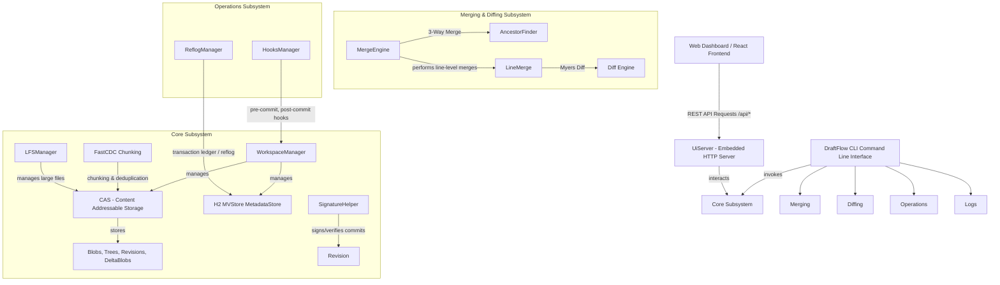

# DraftFlow VCS: High-Performance Snapshot-based DAG Version Control System

DraftFlow is a high-performance, snapshot-based version control system built on a Directed Acyclic Graph (DAG). Designed to combine the flexibility of Git with modern optimizations, DraftFlow features Content Defined Chunking (FastCDC) for block-level deduplication, ECDSA cryptographic commit signing, concurrent CLI/Web transaction safety, and a fully reactive web dashboard.

---

## Table of Contents
1. [Key Features](#key-features)
2. [System Architecture](#system-architecture)
3. [Component Breakdown](#component-breakdown)
4. [Environment Setup & Installation](#environment-setup--installation)
5. [Command Line (CLI) Reference](#command-line-cli-reference)
6. [Interactive Web Dashboard](#interactive-web-dashboard)
7. [Standard Workflows & Recipes](#standard-workflows--recipes)
8. [Hooks & Customization](#hooks--customization)

---

## Key Features
* **Variable-Size Block Deduplication**: Powered by Content-Defined Chunking (FastCDC) to identify identical byte blocks across different files or revisions, dramatically reducing storage overhead.
* **Transactional Indexing**: Employs an embedded H2 MVStore database for workspace tracking, reference resolutions, and config configurations, ensuring ACID safety.
* **Dual CLI-Web Concurrency**: Integrates a request-scoped database connection lifecycle filter (`DatabaseLifecycleFilter`) that dynamically opens and releases database locks per request, preventing cross-process locking conflicts.
* **Commit Signatures**: Cryptographic commit verification using ECDSA keys.
* **Hook Trigger System**: Pre-commit and post-commit hook execution engine supporting `.sh` and `.bat` scripts.
* **Git Compatibility**: Native utilities to import from or export history to a Git repository.

---

## System Architecture

DraftFlow is architected around a decoupling of the interface layer (CLI & Web UI), the metadata index, and the Content Addressable Storage (CAS) object repository.



---

## Component Breakdown

### 1. `com.draftflow.core`
* **`CAS.java` (Content Addressable Storage)**: Manages directory structures, compresses object payloads with zlib (deflate), and resolves short object hashes.
* **`WorkspaceManager.java`**: Evaluates workspace file trees, computes modified/deleted files, builds chunk-level commit trees, and stages checkouts.
* **`FastCDC.java`**: Implements Fast Content-Defined Chunking using a sliding gear hash window to partition files into chunks based on contents rather than fixed sizes.
* **`LFSManager.java`**: Deducts large binary files from standard VCS indexing and routes them to a dedicated LFS object store.

### 2. `com.draftflow.db`
* **`MetadataStore.java`**: Implements reference management and tracking index mapping (files, sizes, hashes, conflict markers) powered by H2 MVStore.
* **`FileMetadata.java`**: Model mapping database state per workspace file path.

### 3. `com.draftflow.merge`
* **`MergeEngine.java`**: Discovers the Common Ancestor (LCA) using DAG traversal and routes differences.
* **`LineMerge.java`**: Executes line-level diff3 merges, inserting conflict markers (`<<<<<<< OURS`, `=======`, `>>>>>>> THEIRS`) when overlapping modifications cannot be auto-merged.

### 4. `com.draftflow.ui`
* **`UiServer.java`**: Spawns an embedded HTTP server (JDK HttpServer) serving static dashboard resources and hosting REST API routing to bridge frontend controls.

---

## Environment Setup & Installation

### Prerequisites
* **Java Development Kit (JDK) 17 or higher**
* **Node.js 18+ & npm** (for UI styling/frontend compilation)

### Building the Project
DraftFlow uses Gradle/local paths for compiling. You can build the backend classes with:
```powershell
# Get all source files and compile to target/classes
$javaFiles = Get-ChildItem -Path src/main/java -Filter *.java -Recurse | ForEach-Object { $_.FullName }
javac -cp "path/to/gson.jar;path/to/picocli.jar;path/to/h2.jar" -d target/classes $javaFiles
```

### Compiling the Frontend Dashboard
If you make changes to the React frontend UI, compile the bundle so the backend embedded server picks it up:
```bash
cd fontend
npm install
npm run build
```
*Note: The built assets are compiled directly into `src/main/resources/web` for packaging.*

---

## Command Line (CLI) Reference

The main entry point is `com.draftflow.DraftFlow`. Specify the classpath pointing to class output and libraries:
```powershell
java -cp "target/classes;libs/*" com.draftflow.DraftFlow [command] [options]
```

### 1. Repository Initializing & Status
* **`setup`**
  * *Use*: Initialize a new DraftFlow repository.
  * *Syntax*: `draftflow setup`
* **`status`**
  * *Use*: Show modified, deleted, conflict-marked, and untracked changes in the working directory.
  * *Syntax*: `draftflow status`

### 2. Snapshot & Commit Management
* **`save`**
  * *Use*: Commit staged workspace modifications as a permanent snapshot revision.
  * *Syntax*: `draftflow save -m "Commit message" [-p]`
  * *Options*:
    * `-m, --message`: Description of the snapshot (Required).
    * `-p, --patch`: Interactive patching mode.
* **`undo`**
  * *Use*: Rollback the latest commit or discard working tree modifications.
  * *Syntax*: `draftflow undo`

### 3. Branches & DAG Traversal
* **`branch`**
  * *Use*: Manage branches.
  * *Syntax*: `draftflow branch [-c <name>] [-d <name>]`
  * *Options*:
    * `-c, --create <name>`: Create a branch.
    * `-d, --delete <name>`: Delete a branch.
    * *No Options*: Lists all available branches.
* **`switch`**
  * *Use*: Check out a specific revision hash or switch active branch.
  * *Syntax*: `draftflow switch <ref_or_hash>`
* **`history`**
  * *Use*: Print visual text commit graph showing revision parents and author messages.
  * *Syntax*: `draftflow history`

### 4. Merging & Conflict Resolution
* **`merge`**
  * *Use*: Merge target branch or revision hash into the current active branch.
  * *Syntax*: `draftflow merge <target_branch_or_hash>`
* **`resolve`**
  * *Use*: Mark conflict files as resolved after manual remediation.
  * *Syntax*: `draftflow resolve <file_path>`

### 5. Remote Syncing
* **`upload`**
  * *Use*: Push commits and pack objects to the remote server.
  * *Syntax*: `draftflow upload <remote_url>`
* **`download`**
  * *Use*: Fetch revisions and objects from the remote repository.
  * *Syntax*: `draftflow download <remote_url>`

### 6. Interactive Stashing & Rebasing
* **`stash`**
  * *Use*: Save workspace changes to a temporary stack to clean the tree.
  * *Syntax*: `draftflow stash [--push] [--list] [--pop]`
* **`rebase`**
  * *Use*: Reapply current branch modifications on top of an upstream branch.
  * *Syntax*: `draftflow rebase <upstream_branch_or_hash> [-i]`
* **`cherry-pick`**
  * *Use*: Apply commits from an arbitrary revision onto the current branch.
  * *Syntax*: `draftflow cherry-pick <revision_hash>`

### 7. Diagnostics, Verification & Cleanups
* **`verify`**
  * *Use*: Scan database and integrity checksums of CAS object stores, repairing any corruption.
  * *Syntax*: `draftflow verify`
* **`prune`**
  * *Use*: Perform garbage collection, removing unreachable loose objects.
  * *Syntax*: `draftflow prune`
* **`clean`**
  * *Use*: Clear untracked files from the workspace directory.
  * *Syntax*: `draftflow clean [-d] [-f] [-x]`
  * *Options*:
    * `-d`: Delete directories.
    * `-f, --force`: Force deletions.
    * `-x`: Remove ignored patterns.

### 8. Audit & History Tracing
* **`ledger`**
  * *Use*: Show transaction history log (reflog) of local operations.
  * *Syntax*: `draftflow ledger`
* **`trace`**
  * *Use*: Annotate lines of a file showing revision history contribution (blame).
  * *Syntax*: `draftflow trace <file_path>`

---

## Interactive Web Dashboard

To launch the GUI, execute:
```powershell
java -cp "target/classes;libs/*" com.draftflow.DraftFlow dashboard
```
This launches an embedded HTTP service hosting:
* **Port**: `http://localhost:8080`
* **State Updates**: Auto-polls status information and executes commands (switch, merge, stash, pull requests) by posting to `/api/action`.
* **State Re-sync**: Employs connection release lifecycle, allowing you to use terminal CLI commands side-by-side without database lock blocking.

---

## Standard Workflows & Recipes

### Basic Save Cycle
```bash
# 1. Initialize
draftflow setup

# 2. Check changes
draftflow status

# 3. Save commit
draftflow save -m "Initial commit"
```

### Branching and Merging
```bash
# 1. Create feature branch
draftflow branch -c feature-oauth

# 2. Switch branch
draftflow switch feature-oauth

# 3. Save changes
draftflow save -m "Implement authentication"

# 4. Return and merge
draftflow switch main
draftflow merge feature-oauth
```

### Git Interoperability
```bash
# Import full git revision graph into DraftFlow
draftflow git-import C:/projects/my-git-repo

# Export DraftFlow repository snapshots to Git
draftflow git-export C:/projects/exported-git-repo
```

---

## Hooks & Customization

DraftFlow includes script hook trigger points configured in `.draftflow/hooks/`.
* **`pre-commit`**: Executed before saving commits. Returning a non-zero exit status aborts compilation.
* **`post-commit`**: Executed after saving commits completes.
* **`pre-rebase`**: Runs before rebase operations begin.
* **`pre-push`**: Runs before upload transmission begins.
* **`post-checkout`**: Executed after branch switch completes.
