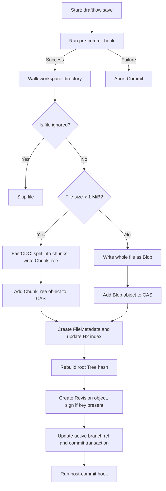

# DraftFlow VCS

*High‑Performance, snapshot‑based version control system built on a Directed Acyclic Graph (DAG).*  

---

## Table of Contents

1. [Overview](#overview)
2. [Advanced Architecture](#advanced-architecture)
3. [Interactive Web Dashboard](#interactive-web-dashboard)
4. [Command‑Line Interface (CLI) Reference](#command‑line-interface-cli-reference)
5. [Execution Flow Details](#execution-flow-details)
6. [Hooks & Customisation](#hooks--customisation)
7. [Standard Workflows & Recipes](#standard-workflows--recipes)
8. [Testing & Verification](#testing--verification)

---

## Overview

DraftFlow combines the flexibility of Git with modern storage and indexing optimisations.  
Key differentiators:
- **Content‑Defined Chunking (FastCDC)** – deduplicates at the block level for large binary files.
- **ACID‑compliant metadata store** – an embedded H2 MVStore database guarantees transactional consistency.
- **Zero‑lock concurrency** – the web dashboard and CLI can run side‑by‑side without database lock contention.
- **Cryptographic commit signing** – optional ECDSA signatures ensure provenance.
- **Full‑stack UI** – a reactive React dashboard visualises commits, branches, snapshots, merges and line‑by‑line blame.

---

## Advanced Architecture

### 1. Object Model & Content‑Addressable Storage (CAS)
- **Objects** are immutable and identified by a SHA‑256 hash.
  - `Blob` – raw file content (compressed with zlib).
  - `ChunkTree` – metadata for files > 1 MiB, pointing to a list of chunk hashes.
  - `Tree` – directory structure mapping filenames → object hashes.
  - `Revision` – a snapshot of the repository tree, parent hash list, author, timestamp, optional change‑ID and message.
- **Storage layout**: objects are stored under `objects/XX/YY…` where `XX` are the first two hex characters of the hash, reducing directory depth and improving lookup speed.

### 2. FastCDC Variable‑Size Chunking
- FastCDC analyses a sliding window (average 8 KiB, min 4 KiB, max 16 KiB) to locate content‑based boundaries.
- Identical content yields identical chunk hashes regardless of surrounding file modifications, resulting in high deduplication rates across revisions.
- Chunk trees are written as a single CAS object referencing the ordered list of chunk hashes and original file size.

### 3. Transactional Index Layer (H2 MVStore)
| Map | Purpose |
|---|---|
| `files` | Tracks workspace files – path, hash, size, last‑modified time, type (`BLOB`, `CHUNK_TREE`, `CONFLICT`). |
| `refs` | Branch and tag references (e.g. `heads/main → <hash>`). |
| `config` | Repository configuration – author name/email, activeChangeId, activeRevisionHash, activeHead, etc. |
| `changeRevisions` | Maps change‑IDs to the latest permanent revision hash for quick lookup. |

All reads/writes are performed inside a short‑lived transaction.  When the HTTP server processes an API request it opens a connection, performs the operation, then releases it – this prevents long‑running locks and allows CLI commands to run concurrently.

### 4. Zero‑Lock Concurrency Architecture
- **DatabaseLifecycleFilter** (in the backend) opens a transaction per request and closes it automatically.
- The CLI executes its own short‑lived transaction via `runLockedCommand`.
- Because each transaction is brief and isolated, the UI can poll status or issue actions while the user runs `draftflow` commands in a terminal without encountering “database locked” errors.

---

## Interactive Web Dashboard

```powershell
# Launch the embedded UI server
java -cp "target/classes;libs/*" com.draftflow.DraftFlow dashboard -p 8085
```

- **Port**: `http://localhost:8085`
- **Live Statistics** – commits, branches, contributors, latest snapshot message, and repository size are computed on‑fly by querying the MVStore index.
- **Routing** – URL parameters (`/repo/<repoId>/commits`, `/snapshots`, `/trace`) automatically trigger `selectRepository` in `RepoContext.jsx` which uses `useParams` to load the correct repository state.
- **State Synchronisation** – The dashboard polls `/api/status` and posts actions to `/api/action` (switch, merge, stash, pull‑request). The backend releases its DB connection after each request, guaranteeing the UI never blocks the CLI.

### Mermaid Diagram – Save Commit Lifecycle



---

## Command‑Line Interface (CLI) Reference

| Command | Arguments / Options | Description | Core Internal Action |
|:---|:---|:---|:---|
| `setup` | – | Initialise a new DraftFlow repository in the current directory. | Creates `.draftflow` folder, `objects/` store and empty `index.mv.db`. |
| `status` | – | Show modified, deleted, conflicted, and untracked files. | Compares workspace files with `files` map in MVStore. |
| `save` | `-m, --message <msg>` (required) `-p, --patch` (optional) | Promote current workspace changes to a permanent commit. | Runs pre‑commit hook, indexes files, writes tree/revision objects, updates refs, runs post‑commit hook. |
| `undo` | – | Revert the latest commit or discard working‑tree modifications. | Moves `activeRevisionHash` back to the parent revision, clears workspace if needed. |
| `branch` | `-c, --create <name>` – create branch; `-d, --delete <name>` – delete branch; *no options* – list all branches. | Manage branch references. | Manipulates entries in the `refs` map. |
| `switch` | `<ref_or_hash>` | Checkout another branch or a specific revision. | Resolves target hash, writes its tree to the workspace, updates `activeHead` / `activeRevisionHash`. |
| `history` | – | Display a textual DAG of revisions. | Traverses parent hashes of each `Revision` object. |
| `merge` | `<branch_or_hash>` | Merge another branch into the current HEAD. | Finds LCA, performs 3‑way line diff, creates merge `Revision`. |
| `resolve` | `<file_path>` | Mark a conflicted file as resolved after manual edit. | Clears conflict flag in `files` map. |
| `stash` | `--push` – push current changes; `--list` – list stashes; `--pop` – apply last stash. | Temporarily store dirty workspace state. | Saves snapshot under a hidden `stash/*` ref. |
| `rebase` | `<upstream>` `-i` (interactive) | Replay current branch commits on top of another branch. | Sequentially applies patches from the branch onto the upstream tip. |
| `cherry-pick` | `<revision_hash>` | Apply a specific commit onto the current branch. | Generates a patch from the revision and applies it as a new commit. |
| `hooks` | – | List, enable, or disable repository hooks. | Scans `.draftflow/hooks/` for executable scripts. |
| `keys` | – | Generate an ECDSA key‑pair for signing commits. | Stores private key under `.draftflow/keys/`. |
| `upload` | `<remote_url>` | Push commits and objects to a remote DraftFlow server. | Streams new CAS objects and updates remote refs. |
| `download` | `<remote_url>` | Pull commits and objects from a remote DraftFlow server. | Retrieves missing objects and updates local refs. |
| `git-import` | `<git_repo_path>` | Import an existing Git repository into DraftFlow. | Reads Git objects, converts to CAS, populates MVStore. |
| `git-export` | `<target_path>` | Export DraftFlow history as a Git repository. | Recreates Git tree and commits from DraftFlow objects. |
| `ledger` | – | Show the reference‑log (reflog) of repository actions. | Queries transaction log tables in MVStore. |
| `trace` | `<file_path>` | Annotate each line of a file with its last‑changing commit (blame). | Walks the revision DAG backwards to identify line authorship. |
| `verify` | – | Scan CAS objects and index for integrity, reporting corruption. | Re‑calculates hashes for every object and cross‑checks the database. |
| `prune` | – | Delete unreachable objects from the CAS store. | Performs a reachability analysis from all branch heads. |
| `clean` | `-d` (remove dirs) `-f` (force) `-x` (ignore patterns) | Remove untracked files from the workspace. | Deletes files not present in the `files` map. |
| `config` | `[key] [value]` | Get or set repository configuration values. | Reads/writes the `config` map in MVStore. |

---

## Execution Flow Details

### Stash Flow
1. **Push** – the current dirty workspace is saved as a new `Revision` (draft) and a reference `stash/<id>` is created.
2. **List** – reads all `stash/*` refs from the database.
3. **Pop** – the stash revision is checked out, the reference is removed, and the workspace reflects the saved state.

### Rebase Flow
1. Resolve the **upstream** tip and the **fork point** (common ancestor).
2. Compute the list of commits on the current branch after the fork point.
3. Sequentially **apply** each commit as a patch onto the upstream tip, creating new draft revisions.
4. If a conflict occurs, the rebase halts, leaving the workspace in a conflicted state for manual resolution.

### Trace / Blame Flow
1. Load the target file’s current `Tree` entry to obtain its blob hash.
2. Walk the revision DAG backwards, comparing each revision’s version of the file.
3. For each line, the first revision that introduced the line is recorded as its author/date.
4. Output a table of `line → commit → author → date`.

### Git Interoperability Flow
- **Import** parses Git pack files, reconstructs a DAG of `Commit` objects, converts them to DraftFlow `Revision` objects, writes blobs/trees to the CAS, and creates matching branch refs.
- **Export** performs the inverse: it walks DraftFlow branches, recreates Git objects, packs them, and writes a standard `.git` directory.

---

## Hooks & Customisation

DraftFlow supports script hooks placed in `.draftflow/hooks/`.  The following hook points are recognised:
- `pre‑commit` – runs before a `save` operation. Non‑zero exit aborts the commit.
- `post‑commit` – runs after a successful commit.
- `pre‑rebase` – runs before a `rebase` starts.
- `pre‑push` – runs before `upload` transmits data.
- `post‑checkout` – runs after a branch `switch` completes.

Hooks can be either **shell (`.sh`)** scripts (Unix) or **batch (`.bat`)** scripts (Windows).  They receive the repository root as `$1` (POSIX) or `%1` (Windows) and can access environment variables such as `DF_CHANGE_ID` and `DF_REVISION_HASH`.

---

## Standard Workflows & Recipes

### Basic Save Cycle
```bash
# Initialise repository
 draftflow setup

# Check workspace status
 draftflow status

# Commit changes
 draftflow save -m "Initial commit"
```

### Branching and Merging
```bash
# Create a feature branch
 draftflow branch -c feature/oauth
 draftflow switch feature/oauth

# Make changes and commit
 echo "auth code" >> auth.txt
 draftflow save -m "Add OAuth helper"

# Switch back and merge
 draftflow switch main
 draftflow merge feature/oauth
```

### Stashing Work in Progress
```bash
# Save dirty work without a commit
 draftflow stash --push

# Work on a different task, then restore
 draftflow stash --pop
```

### Rebase Example (interactive)
```bash
 draftflow rebase main -i
```
The interactive mode opens an editor with the list of commits to be replayed, allowing you to reorder, squash or edit them.

---

## Testing & Verification

DraftFlow ships with an extensive integration test suite.  To run it:
```powershell
# From the project root
 .\run-vcs-tests.ps1
```
The script compiles the backend, creates a temporary workspace, and exercises the full command set (setup, save, branch, merge, rebase, git‑import/export, hooks, garbage collection, etc.).  All tests must pass before a release.

---

*This README is generated from a structured plan and aims to provide developers with a clear, semi‑technical overview of DraftFlow’s design, usage, and internals.*
